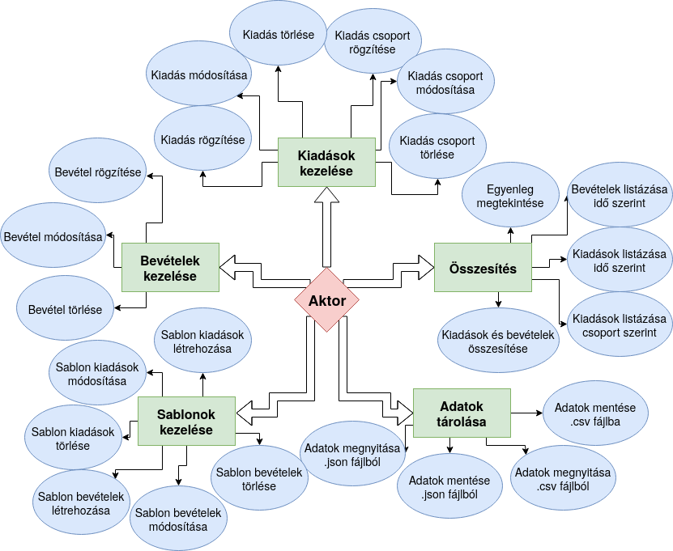
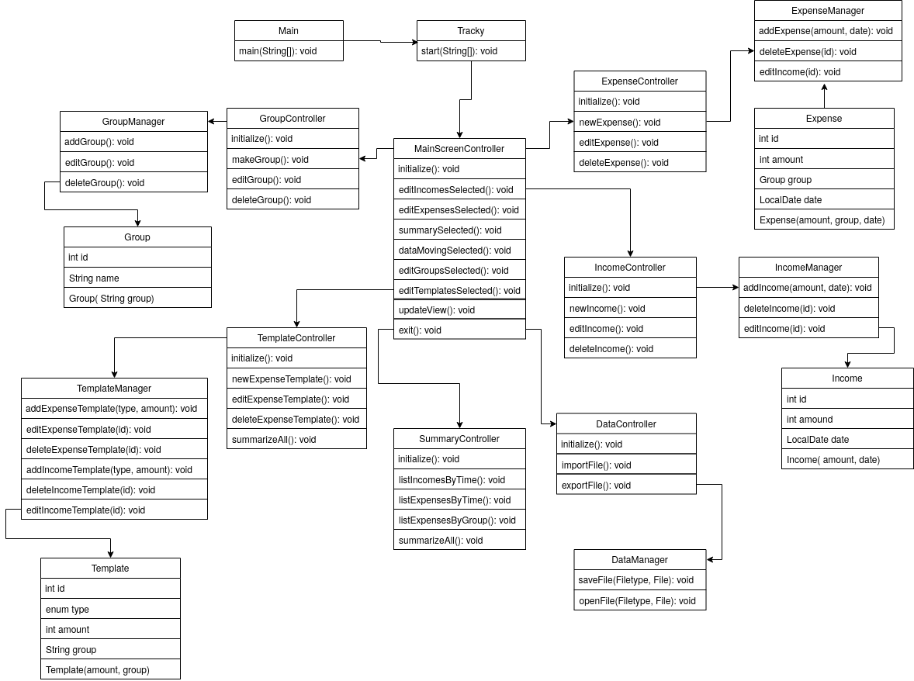

# Rendszerterv
## A rendszer célja
- **A rendszer céljai:**

	- A rendszer célja, hogy a jelenleg papíron vezetett kiadás és bevétel kezelés lecserélése egy alkalmazásra. Ennek az alkalmazásnak egy érthető, és egyszerűen navigálható grafikus felhasználói felülettel kell rendelkeznie a könnyű használhatóság érdekében.

	- Fontos továbbá az is, hogy a megadott bevételeket és kiadásokat többféleképpen is lehessen rendezni.

	- Ilyen rendezési alap például a kiadás típusa. Ez alatt azt értjük, hogy a felhasználó megadhatja azt, hogy például az adott kiadást mire költötte el. Ilyen lehet például az étel, a csekkek befizetése, cigaretta stb.

	- Egy másik rendezési alap pedig a dátum. A felhasználó megadhat egy kezdődátumot, és egy végdátumot, majd a rendszer a két dátum közötti időszak bevételeit automatikusan összesíti.

	- Valamint lehessen statisztikai kimutatásokat is létrehozni az adatokból annak érdekében, hogy ne kézzel kelljen ezeket kiszámolni. A kimutatásoknak könnyen érthetőnek kell lennie.

	- Végül pedig fontos, hogy a lokális adatokat exportálni lehessen .csv fájlba annak érdekében, hogy a megadott adatok könnyen hordozhatóak legyenek.

- **A rendszernek nem céljai:**

	- Az alkalmazásnak nincs olyan része, ami online kapcsolatot igényelne, éppen ezért a rendszernek nem célja semmilyen online kapcsolatot kialakítani egy szerverrel se online adattárolás, sem pedig online hitelesítés miatt.

	- Az adatok tárolása csakis lokális formában valósuljon meg.

	- Egy eszközön a rendszernek csupán egy felhasználó egy adott költségvetési adatait kell nyílván tartania, azaz nem egy többfelhasználós rendszer a cél.

	- A rendszernek továbbá nem célja sem egy akadálymentes mód biztosítása, sem pedig különböző nyelvek támogatása.

## Projekt terv
## Üzleti folyamatok modellje
**Üzleti szereplők:** Az üzleti szereplők, mostantól *aktorok*: olyan személyek, akik a megrendelő
cég alkalmazottai és a jövőben az elkészült programot fogják használni az üzleti folyamatok
végrehajtásához.

**Üzleti folyamatok:** 

* **Kiadás felvitele lokális fájlba:** Ez a folyamat akkor következik be, amikor az aktorok új kiadással
   szembesülnek. Ekkor az alkalmazás megnyitását követően lehetőségük van az aktoroknak a kiadást
   a programban lejegyezni, amely a későbbiekben egyéb képességeket biztosít a régi üzleti folyamatokkal
   szemben.
   
 * **Bevételek felvitele lokális fájlba:** Ez a folyamat akkor következik be, amikor az aktorok új bevétellel
   szembesülnek. Ekkor az alkalmazás megnyitását követően lehetőségük van az aktoroknak a bevételt
   a programban lejegyezni, amely a későbbiekben egyéb képességeket biztosít a régi üzleti folyamatokkal
   szemben. 
   
* **Tételek csoportosítása:**  Ez a folyamat az összesítések alkalmával fontos, mivel amikor az aktoroknak
csoportosítania kell bizonyos tétel csoportokat, az elkészülő program segítségével rengeteg erőforrást
spórolhat meg a megrendelő. A folyamat működése azon alapszik, hogy a tételek felvitelekor minimális
erőforrás befektetésével hosszú távon sokat meg lehet takarítani. A folyamat úgy zajlik, hogy amikor
az aktor felviszi a tételt, megad egy tétel csoportot, ami még manuális munka, azonban a munka jelentős
része automatizálható az által, hogy a csoportosítást a számítógép végzi el.

* **Összesítés:** Ebben a folyamatban az aktorok számára legmegterhelőbb feladatot terheljük rá az
informatikai berendezésre, amely a csoportosítás és statisztikai elemzés készítése. Mivel a számítógépek
sokkal jobbak a matematikai számítások elvégzésében, ezért ez volt a legnagyobb oka a gépesített rendszer
igényének felmerülésére. Az aktoroknak elég néhány gombot megnyomnia, specifikálni néhány beállítást és
a rendszer már ki is számítja a meglévő adatok alapján a költségvetést a specifikált időintervallumra.

**Erőforrás igények:**

**Jelenlegi üzleti folyamatok:**
* Kiadás rögzítése: 1 aktor, 3-5 perc.

* Bevétel rögzítése: 1 aktor, 3-5 perc.

* Tételek csoportosítása: 1-2 aktor, 1-2 óra, egy havi bevételek és kiadások esetében, 
	amelyek összesített száma nem haladja meg az egyezer tételt.
	
* Összesítés: 2-3 aktor, 6-9 óra egy havi bevételek és kiadások esetében, amelyek
	összesített száma nem haladja meg az ötezer tételt.

**Igényelt üzleti folyamatok:**
* Kiadás rögzítése: 1 aktor, 1-2 perc.

* Bevétel rögzítése: 1 aktor, 1-2 perc.

* Tételek csoportosítása: 1 aktor, 2-5 perc akár több mint ötezer tétel esetén is.
	
* Összesítés: 1 aktor, 3-5 perc akár több mint ötezer tétel esetén is.

## Követelmények
## Funkcionális terv
## Fizikai környezet
- Az alkalmazás androidos mobiltelefonokra, java nyelven kell, hogy elkészüljön, mivel ez a nyelv a legkedveltebb a mobil alkalmazások készítéséhez.

- Az alkalmazás elkészítéséhez az Android studio nevű programot fogjuk használni, mert egyszerűen lehet androidos alkalmazásokat készíteni vele, különösen a programok frontend részét.

- A programnak a minimális erőforrásigénye miatt nincs semmilyen különleges hardverigénye.

- A programnak nincs semmilyen internetkapcsolatot igénylő eleme, éppen ezért nem támaszt semmilyen igényt sem az eszköz tűzfalával, sem a portokkal kapcsolatban.

- Minden esetleges függőség a program részét fogja képezni, és azzal eggyütt fog feltelepülni, éppen ezért nincs szükség semmilyen külső szoftverre az alkalmazás helyes működéséhez.

- Az adatok lokális fájlba mentéséhez, valamint a lokális fájlból az adatok megnyitásához a felhasználónak engedélyezni kellesz azt, hogy az alkalmazás hozzáférjen a mobiltelefon tárhelyéhez, és módosítsa azt.

## Absztrakt domain modell

## Architekturális terv

## Implementációs terv
## Tesztterv
## Telepítési terv
## Karbantartási terv
