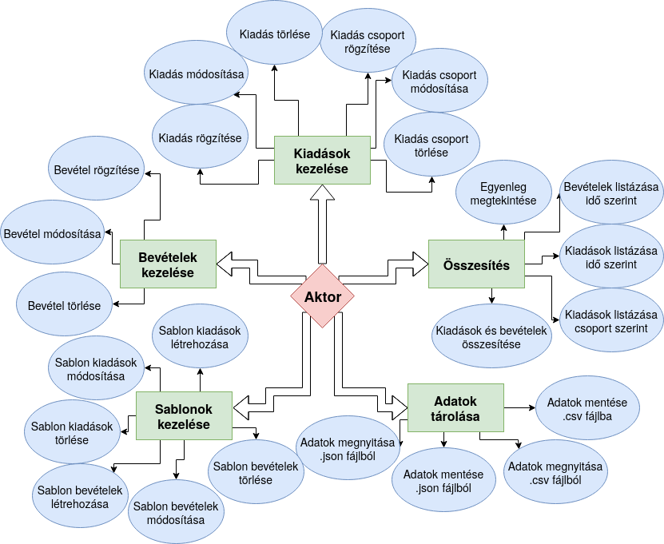
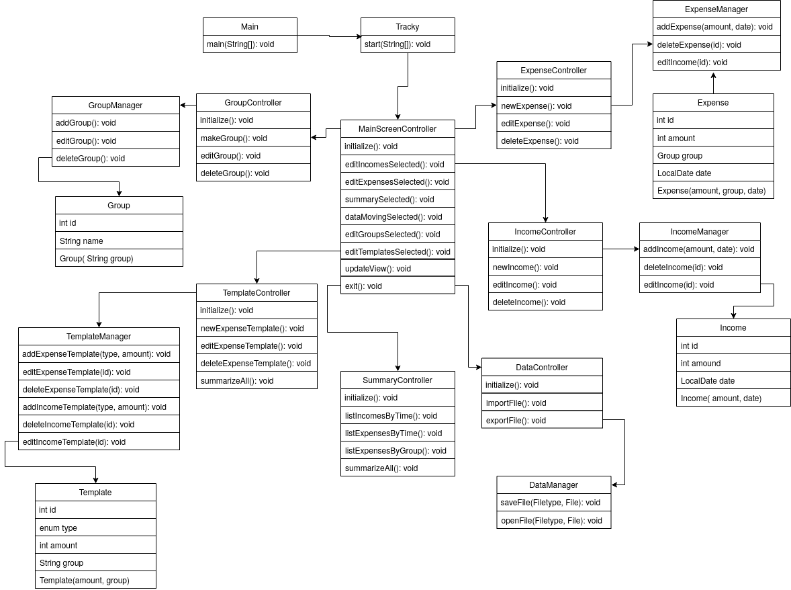

# Rendszerterv

## A rendszer célja
- **A rendszer céljai:**

	- A rendszer célja, hogy a jelenleg papíron vezetett kiadás és bevétel kezelés
	lecserélése egy androidos alkalmazásra. Ennek az alkalmazásnak egy érthető,
	és egyszerűen navigálható grafikus felhasználói felülettel kell rendelkeznie
	a könnyű használhatóság érdekében.

	- Az alkalmazásnak a következő funkciókkal kell rendelkeznie.
	   - Bevétel felvitele az adatbázisba => Bal felső menü -> Bevétellista -> Jobb alsó
	   lebegő gomb -> Összeg és leírás megadása -> Hozzáad gomb megnyomása

	   - Bevétel törlése az adatbázisból => Bal felső menü -> Bevétellista ->
	   A törölni kívánt tétel elhúzása ujjal

	   - Minden Bevétel törlése az adatbázisból => Bal felső menü -> Bevétellista ->
	   Jobb alsó lebegő gomb -> Összes Törlése gomb megnyomása

	   - Bevétel szerkesztése => Bal felső menü -> Bevétellista -> Szerkeszteni kívánt
	   Bevétel kiválasztása -> Az új adatok megadása -> Mentés

	   - Kiadás felvitele az adatbázisba => Bal felső menü -> Kiadáslista -> Jobb alsó
	   lebegő gomb -> Összeg és leírás és csoport megadása -> Hozzáad gomb megnyomása

	   - Kiadás törlése az adatbázisból => Bal felső menü -> Kiadáslista ->
	   A törölni kívánt tétel elhúzása ujjal

	   - Minden Kiadás törlése az adatbázisból => Bal felső menü -> Kiadáslista ->
	   Jobb alsó lebegő gomb -> Összes Törlése gomb megnyomása

	   - Kiadás szerkesztése => Bal felső menü -> Kiadáslista -> Szerkeszteni kívánt
	   kiadás kiválasztása -> Új értékek megadása -> Mentés

	   - Csoport felvitele az adatbázisba => Bal felső menü -> Csoportlista -> Jobb alsó
	   lebegő gomb -> Csoport nevének a megadása -> Hozzáad gomb megnyomása

	   - Csoport törlése => Bal felső menü -> Csoportlista -> A törölni kívánt csoport
	   elhúzása ujjal valamelyik irányba.

	   - Minden csoport törlése => Bal felső menü -> Csoportlista -> Jobb alsó lebegőgomb ->
	   Minden csoport törlése gomb megnyomása

	   - Csoport szerkesztése => Bal felső menü -> Csoportlista -> Szerkeszteni kívánt
	   csoport kiválasztása -> Új név megadása -> Mentés

	   - Minden bevétel és kiadás listázása => Bal felső menü -> Összesítés

	   - Bevételek szűrése => Bal felső menü -> Összesítés -> Megadni a dátumot
	   és/vagy összeget -> Kiválasztani a Bevételek rádiógombot -> Kilistáz gomb

	   - Kiadások szűrése => Bal felső menü -> Összesítés -> Megadni a dátumot
	   és/vagy összeget -> Kiválasztani a Kiadások rádiógombot -> Kilistáz gomb

	   - Kiadások és Bevételek szűrése => Bal felső menü -> Összesítés -> megadni
	   a dátumot és/vagy összeget -> Kiaválasztani a Mindkettő rádiógombot -> Kilistáz gomb

- **A rendszernek nem céljai:**

	- Az alkalmazásnak nincs olyan része, ami online kapcsolatot igényelne, éppen ezért a rendszernek nem célja semmilyen online kapcsolatot kialakítani egy szerverrel se online adattárolás, sem pedig online hitelesítés miatt.

	- Az adatok tárolása csakis lokális formában valósuljon meg.

	- Egy eszközön a rendszernek csupán egy felhasználó egy adott költségvetési adatait kell nyílván tartania, azaz nem egy többfelhasználós rendszer a cél.

	- A rendszernek továbbá nem célja sem egy akadálymentes mód biztosítása, sem pedig különböző nyelvek támogatása.

## Projekt terv
1. A program alap GUI-át megcsinálni.
	* A főscreenen lévő táblázatot
	* Főscreen gombjai, és Balance-a
	* Expenslist, táblázata
	* Incomelist, táblázata
	* Incomelist és Expenselist swipe funkció
	* Floating button for Expense and Incomelist
	* Data customize window
2. Megcsinálni a programunkhoz tartózó fájlrendszert ebbe:
    * Tudjunk írni a hozzáadás gomb segítségével
    * Beolvasni a fájlban lévő adatokat és beilleszteni a táblázatunkba
    * Szerkeszteni a fájlban / táblázatban lévő adatokat
    * Törölni adatokat
3. Az adattípusok elkülönítése.
4. Az oldalról kijövő menüt, és a menüpontjait, és ezeknek designja.
5. Statisztika menüpontot, ahol akár hónapos statisztikákat tudunk megnézni a költekezéseinkról, vagy bevételünkről. 
6. Rendezés, ezzel együtt típus alapú rendezés, amikor csak egy bizonyos típusú elemeket fog megjeleníteni. Például, csak a office kellékek csoportját, és ezen belül tollak, papír stb.
7. Tudjuk az adatainkat impotálni és exportálni ezzel biztosítva a mozgathatóságot.

## Üzleti folyamatok modellje
**Üzleti szereplők:** Az üzleti szereplők, mostantól *aktorok*: olyan személyek, akik a megrendelő
cég alkalmazottai és a jövőben az elkészült programot fogják használni az üzleti folyamatok
végrehajtásakor.

**Üzleti folyamatok:** 

* **Kiadás felvitele lokális adatbázisba:** Ez a folyamat akkor zajlik le, amikor az aktoroknak új kiadást
	kell rögziteniük. Ekkor az aktorok megnyitják az applikációt az Androidos okostelefonjukon vagy
	tabletjükön, amiben lehetőségük nyílik az új kiadás rögzítésére mind kézzel, mind a beépített sablon
	kezelő modul segítségével, feltételezve, hogy már rendelkeznek korábban rögzített sablonnal. Ez természetesen
	már hatalmas előny a korábbi üzleti folyamatokkal szemben, azonban ez a rendszer más teljesen új lehetőséget
	nyit meg az aktorok és a megrendelő számára egyaránt.
   
 * **Bevételek felvitele lokális fájlba:** Ez a folyamat akkor zajlik le, amikor az aktoroknak új bevételt
	kell rögziteniük. Ekkor az aktorok megnyitják az applikációt az Androidos okostelefonjukon vagy
	tabletjükön, amiben lehetőségük nyílik az új bevétel rögzítésére mind kézzel, mind a beépített sablon
	kezelő modul segítségével, feltételezve, hogy már rendelkeznek korábban rögzített sablonnal. Ez természetesen
	már hatalmas előny a korábbi üzleti folyamatokkal szemben, azonban ez a rendszer más teljesen új lehetőséget
	nyit meg az aktorok és a megrendelő számára egyaránt.
   
* **Tételek csoportosítása:**  Ez a folyamat az összesítések alkalmával a legfontosabb, azonban az időközi
	ellenőrzések alkalmával is ugyanolyan hasznos segítséget nyújt. Amikor az aktoroknak csoportosítania 
	kell bizonyos tétel csoportokat, az elkészülő program segítségével rengeteg időt és energiát szabadít fel
	az aktorok számára, valamint jelentős összegeket spórolhat meg a megrendelő ennek köszönhetően.
	A folyamat működése azon alapszik, hogy a tételek felvitelekor minimális idő és energia befektetésével
	hosszú távon nagyon sokat meg lehet takarítani. A csoportosítás úgy történik, hogy amikor
	az aktor felviszi a tételt, megad egy tétel csoportot, ami még manuális munka, azonban a munka
	számottevő része automatizálható az által, hogy a csoportosítást a számítógép végzi el.

* **Összesítés:** Végül a legtöbb erőforrást igénylő feladatot adjuk át a programnak, amely nem más
	mint a tételek csoportosítása, valamint azok statisztikai elemzése. Mivel a számítástechnikai 
	berendezések számtalanszor gyorsabbak az embernél, így a matematikai műveletek elvégzése sem
	okoz nehézséget neki. Az aktoroknak a kimutatások készítéséhez elegendő specifikálni a szűrőket,
	mint dátum, vagy összeg határok és amint felpillantanak az összegzést végrehajtó gombról, már el
	is készült a kimutatás. 

**Erőforrás igények:**

* **Jelenlegi üzleti folyamatok:**
	* Kiadás rögzítése: 1 aktor, 3-5 perc.

	* Bevétel rögzítése: 1 aktor, 3-5 perc.

	* Tételek csoportosítása: 1-2 aktor, 1-2 óra, egy havi bevételek és kiadások esetében, 
	  amelyek összesített száma nem haladja meg az egyezer tételt.
	
	* Összesítés: 2-3 aktor, 6-9 óra egy havi bevételek és kiadások esetében, amelyek
	  összesített száma nem haladja meg az ötezer tételt.

* **Igényelt üzleti folyamatok:**
	* Kiadás rögzítése: 1 aktor, kevesebb mint 1 perc.

	* Bevétel rögzítése: 1 aktor, kevesebb mint 1 perc.

	* Tételek csoportosítása: 1 aktor, 2-5 perc akár több mint ötezer tétel esetén is.
	
	* Összesítés: 1 aktor, 3-5 perc akár több mint ötezer tétel esetén is.

## Követelmények
**Funkcionális követelmények:**

* Lokális adat tárolási modul (Local Data Storage module):
	Ez a modul végzi az adatok mentését a felhasználó eszközére, valamint a rendszer indulásakor,
	azoknak a betöltése is ennek a modulnak a feladata. Ezen felül lehetővé teszi a már korábban
	rögzített adatok exportálását olyan formátumban, hogy kompatibilitást nyújtson más az iparban
	leggyakrabban használt adat kezelő, tároló és feldolgozó alkalmazásokkal. Természetesen ezeknek
	az adatoknak az importálását is képes elvégezni az applikációba akár felhasználói beavatkozás nélkül,
	amennyiben az importálandó fájl a rendszer fejlesztői által előírt formában van elkészítve.
	
* Adat kezelői modul (Data Handler module):
	Az adat kezelői modul mind a felhasználó eszközén, mind a távoli szerveren ugyanazt a feladatot
	végzi, rögzíti a kívánt felületen a felhasználó által bevitt adatokat, melyeket a bevétel, kiadás,
	csoport, valamint sablon típusok alkotnak. Magát a bevétel és kiadás típust egységesen tételeknek
	is hívjuk. Természetesen ahogy a nevéből adódik a modul kezelést biztosít, amely nem csak a tételek
	létrehozását vagy sablonok létrehozását jelenti. Feladata még az adatok és a felhasználó között
	kapcsolatot teremteni, ezáltal lehetővé teszi azok szerkesztését, valamint a nem kívánt tartalom
	törlését is.
	
* Adat elemző modul (Data Analytic module):
	Az adat elemző modul feladata, hogy a felhasználó által korábban rögzített adatokat a
	felhasználó számára információvá alakítsa. Ez azt jelenti, hogy a rögzített adathalmazból,
	szűri, rendezi az elemzést végző számára az adatokat, és amennyiben igény van rá, egyéb matematikai
	műveleteket végez el a már szűrt és rendezett halmazokon. Ilyen lehet például a legutóbbi tíz
	tranzakció, a legnagyobb kiadás egy bizonyos hónapban, vagy akár a teljes és totális egyenleg,
	amely minden eddig felvitt tranzakciónak vesszi az összegét.
	
* Sablon kezelő modul (Template Handler module):
	A sablon kezelő modul létezésének egyetlen és legfontosabb célja, az alkalmazás felhasználói
	életének megkönnyítése, valamint idejük megspórolása. Ezt úgy tudják elérni, hogy lehetőséget
	biztosítunk nekik sablonok használatára. A sablonok használata az egyszerű működésük miatt
	gyerek játék, nem beszélve arról, hogy milyen gyorssá teszik a tételek felvitelét. Annyit kell
	tenni, hogy a tétel felvitelekor kiválasztják a sablonnal történő hozzáadást, ezután amennyiben
	nem a legutóljára használt sablont kívánják felhasználni, kiválasztják a használandó sablont.
	Ezt követően amennyiben szükséges, módosítanak a korábban megadott alapértelmezet értékeken,
	majd hozzáadják az új tételt. Ez akár három érintésre is lerövidítheti az amúgy egy perces
	műveletet, ahol számos helyen kellene adatokat begépelni.
	
* Felhasználó kezelő modul (User Handler module):
	Egy opcionálisan választható funkciója lesz az applikációnak a kívülről bevonható erőforrások
	igénybevétele. Ez azt jelenti, hogy ha a jövőben a felhasználó úgy dönt, hogy szeretné igénybe
	venni a Plussz szolgáltatásainkat, rendkívül fontos, hogy a felhasználó adatait csak saját maga
	és azok érhessék el, akiknek engedélyt ad erre. Erre nyújt egy biztonságos megoldást a Felhasználó
	kezlői modul. Feladat, hogy azonosítsa a felhasználót, aki szereretne hozzáférni az adatokhoz,
	valamint az, hogy megakadályozza azokat a személyeket vagy szervezeteket, akik illetéktelenül
	szeretnének hozzáférni mások adataihoz.
	
* Távoli adat tárolási modul (Remote Data Storage module):
	Ez a modul végzi az adatok biztonságos mentését a felhasználó által igényelt távoli szerverre,
	valamint szinkronizálja az adatokat a két rendszer között amikor a felhasználó elindítja
	az applikációt. Ez számos előnnyel járhat a felhasználók számára: Értékes tárhelyet szabadít
	fel az eszközön, ezzel biztosítva, hogy a következő rendezvényen az utolsó kép is elkészülhessen;
	Egy biztonsági mentésként is funkcionál a tárhelyünkön elhelyezett adatok számára, ezzel biztosítva,
	hogy amennyiben a felhasználó okostelefonja vagy táblagépe olyan károsodást szenvedne, amellyel 
	elveszítené adatait, az általunk tárolt példányt bármikor vissza állíthatja új eszközén pillanatok
	alatt, anélkül, hogy elveszítené hónapok vagy évek munkáját; Végül pedig lehetőséget ad olyan 
	felhasználóknak vagy csoportnak, akiknek gyakran váltaniuk kell készülékeiket vagy szeretnének
	közösen dolgozni ugyanazon projekten.
	

**Nem funkcionális követelmények:**
* Hatékonyság:
	Elengedhetetlen, hogy a program képes legyen szinte bármilyen készüléken üzemelni, ami
	azt jelenti, hogy a legnagyobb halmazt alkotó készülékeket is támogatnia kell. Ezek a
	készülékek a régebbi okostelefonok, illetve a mai, azonban olcsó eszközök. Ezen eszközök
	leggyakrabban régebbi operációsrendszert használnak, valamint régi hárdver komponenseket,
	amelyek korlátozzák az egyes modern és gyors program részletek működését, valamint egyes
	esetekben teljesen meg is akadályozzák azt. Viszont arra is ügyelni kell, hogy a régebbi
	program részletek is teljesítsék a minimum sebesség és hatékonysági mércéket a modern
	készülékeken és környezetben.
	
* Megbízhatóság:
	Az egyik legnagyobb előnye a Tracky használatának, a hatékonysága. Azonban a hatékonyságot
	csak megbízhatósággal lehet garantálni. Az egyik legfontosabb alaptétele a rendszernek
	az adatbiztonság. Azonban az adatbiztonság nem csak az eltulajdonítás megakadályozást
	jelenti. A másik kulcsfontosságú szerepe az adatok biztonságos tárolása, amely biztosítja,
	hogy az adatok információtartalma nem sérülhet, módosulhat, és semmisülhet meg. Ezen felül
	biztosítani kell azt, hogy a program a lehető legkevesebb hibát hozzon létre, még akkor is,
	ha ezek a hibák, a felhasználó által, az applikáció helytelen használatából erednek. Ezen
	felül minden egyéb hiba megoldása nem bízható a felhasználóra.
	
* Biztonság:
	Az applikáció készítésekor törekedni kell arra, hogy az adatok a lehető legbiztonságosabb
	módon legyenek eltárolva mind jogi, mind infromatikai értelmezésben. Ezen felül minden
	internetes kommunikáció során azonosítani kell a felhasználót, és titkosított csatornán
	keresztül kell lefolytatni azt, személyes vagy anyagi értékkel rendelkező adat esetén. Fontos az adatok védelme
	az illetéktelen hozzáférésekkel szemben mind kommunikáció mind tárolás szempotjából, így
	minden olyan eszközön biztosítani kell ezt a kritériumot, amely az üzemeltető tulajdonában
	áll, és adat van tárolva vagy átirányítva.

* Hordozhatóság:
	Az elkészült alkalmazásnak az Android operációsrendszert használó okostelefonok valamint
	táblagépek lehető legszélesebb halmazán kell, hogy az elképzelt használat közepes szintjét
	teljesítse. Ez azt, jelenti, hogy az elfogadható sebességű működésen felül alkalmazkodnia
	kell olyan eszköz sajátosságokhoz, mint a képernyő mérete, felbontása, az általa futtatott
	operációsrendszer, valamint a hárdver amelyen a rendszer és az applikáció is fut.
	
	Természetesen a hordozhatóság egyik legfelsőbb szintje ha nem csak eszköz szinten lehet az
	adatokat hordozni, de szoftverek között is. Ezért fontos, hogy az alkalmazás rendelkezzen
	olyan funkciókkal, amelyek biztosítani tudják ezt. Mivel a pénzügyi környezetben majdnem
	minden ember érintett, és a sokféle igényt sokféle szoftver próbálja sajátos módon teljesíteni,
	így fontos, hogy a kompatibilitás a lehető legtöbb ilyen programmal teljesüljön.

* Felhasználhatóság:
	Mivel a program felhasználói sokféle foglalkozási területről eredhetnek, így nem lehet
	elvárás semmilyen előzetes szakmai tudás sem informatikai, sem pénzügyi sem bármilyen egyéb
	más ágazatból. A program használatához szükséges tanulási folyamatot a lehető legkissebb idő
	alatt teljesíthetővé kell tenni azáltal, hogy alapvető és gyakran használt vezérlési
	technikát alkalmazhasson a felhasználó. A felületen csak egyértelmű és szigorúan a 
	felhasználót érintő információ jelenjen meg, lehetőleg fontossági sorrendben. 
	
**Törvényi előírások:**

Mivel a program nem hivatalosan elfogadott dokumentumok előállítását végzi, így az adatok
megjelenítésére, rendezésére, mennyiségére és hitelesítésére jelenleg nem vonatkozik törvényi
előírás. Az alap alkalmazás nem rendelkezik internetes funkcióval, így arra jelenleg törvényi
előírás nem érvényesül, azonban a Plussz verzió által elkért, feldolgozott, továbbított
valamint tárolt személyes adataira az Európai parlament személyes adatok védelméről szóló
határozat érvényesül, valamint a Magyarország által megkövetelt egyéb, az informatika
szolgáltatások nyújtásával kapcsolatos más határozatok követése.

**Informatikai szabványok a programban:**

Mivel az applikáció Android operációsrendszerekkel üzemeltetett okostelefonok, táblagépek
valamint egyéb okos készülékekkel való használatra lett tervezve így fontos, hogy a
program alkalmazkodjon a mobil készülékek sajátosságaihoz. A program lokális adat tárolása
lehetőleg Room adatbázis segítségével kerüljön mentésre. A könnyű fejleszthetőség és
támogatás érdekében szabványos Java programozási nyelvben, annak saját és az
Androidos program könyvtárak felhasználásával készüljön a lehető legkevesebb külős
függőségek vagy szoftverek bevonásával. A program által exportált fájlok szabványos
`.csv` kiterjesztésű adat állományok legyenek, pontosvessző karakter (`;`) szeparátorokkal
elválasztva. Mivel az applikáció elsődleges célközönsége az európai valamint az észak-amerikai
kontinens, így csak azon nyelveket kell támogatnia, azonban azt teljes mértékig, ezért
a programban minden felhasználó által begépelhető és begépelt szöveges adatot az *UTF-8*
karakter kódolási szabvánnyal kell eltárolni, valamint megjeleníteni. 

## Funkcionális terv

## Fizikai környezet
- Az alkalmazás androidos mobiltelefonokra, java nyelven kell, hogy elkészüljön, mivel ez a nyelv a legkedveltebb a mobil alkalmazások készítéséhez.

* Minimum Android API verzió: 21. Ez az Android 5.0 verziót jelöli.

* A fordítási API verzió: 29. Ez az Android 10.0 verziót jelöli

* A Grafikus felhasználói felület szabványos android grafikai csomaggal készüljön.

* A képek jpeg és png formátumúak lehetnek.

* Az alkalmazás támogassa az európai és amerikai kontinensek karakterkészleteit.

* Az adatok lokálisan a készüléken legyenek eltárolva.

* Az adattároláshoz a Room adatbáziskezelőt kell használni

* A dátumoknál az "éééé:hh:nn óó:pp:mm" szabványt kell használni.

* Ehhez a java beépített TypeConverter annotációjának a használata erősen ajánlott.

* Az alkalmazásnak meg kell felelnie az MVC azaz a Model-View-Controller szabványnak.

* A megadott adatokat bármikor lehessen törölni az adatbázisból, amennyiben a
felhasználó azt kéri.

* A különböző oldalak ConstraintLayout típusúak legyenek az egyszerűbb használat
érdekében.

* A különböző drawable fájlokat a res mappán belüli drawable mappában kell tárolni.

* A layout xml fájlokat a res mappán belüli layout mappában kell tárolni.

* A különböző menüket a res csomagon belül a menu csomagban kell létrehozni és tárolni.

* A mipmap fájlok tárolása a res mappán belüli mipmap csomagban kell hogy történjen.

* A navigációs lépések eltárolása a res csomagom belüli navigation csomagban kell,
hogy történjen.

* A használni kívánt értékeket, - ilyenek például a színek - a res mappán belüli values
mappában kell eltárolni.

* Törekedni kell arra, hogy az alkalmazás minél kevesebb erőforrást igényeljen.

* Amennyiben az alkalmazás értesítéseket küld a felhasználónak, akkor a felhasználó
ezeket kapcsolhassa ki.

- Az alkalmazás elkészítéséhez az Android studio nevű programot fogjuk használni, mert egyszerűen lehet androidos alkalmazásokat készíteni vele, különösen a programok frontend részét.

- A programnak a minimális erőforrásigénye miatt nincs semmilyen különleges hardverigénye.

- A programnak nincs semmilyen internetkapcsolatot igénylő eleme, éppen ezért nem támaszt semmilyen igényt sem az eszköz tűzfalával, sem a portokkal kapcsolatban.

- Minden esetleges függőség a program részét fogja képezni, és azzal eggyütt fog feltelepülni, éppen ezért nincs szükség semmilyen külső szoftverre az alkalmazás helyes működéséhez.

## Absztrakt domain modell
A rendszernek öt különböző fő komponense van, amikkel az aktor interaktálni tud.

Az első ilyen komponens a kiadások kezelése, amely minden a kiadással kapcsolatos dolgot magába foglal, amik a következőek: Kiadás rögzítése, Kiadás módosítása, Kiadás törlése, Kiadás csoport rögzítése, Kiadás csoport módosítása, illetve Kiadás csoport törlése.

A második fő komponens a bevételek kezelése, ami minden a bevételekkel kapcsolatos dolgot kezel. Ezek a következőek: Bevétel rögzítése, Bevétel módosítása, illetve Bevétel törlése.

A Harmadik nagy komponense a rendszernek a Sablonok kezelése. Ezen komponens részei a Sablon kiadások módosítása, a Sablon kiadások törlése, a Sablon bevételek létrehozása, valamint a Sablon bevételek törlése.

A negyedik  nagy komponens az adatok tárolása, ami ahogy azt a neve is sugallja minden olyan dologra vonatkozik, aminek köze van az adatok tárolásához. Ezek a következőek: Adatok megnyitása .json fájlból, Adatok mentése .json fájlba, Adatok megnyitása .csv fájlból, valamint Adatok mentése .csv fájlba.

Az ötödik, és egyben utolsó nagy komponense a rendszernek az Összesítés, amely magában tartalmazza a különböző kimutatásokat, amik a következőek: Egyenleg megtekintése, Bevételek listázása idő szerint, Kiadások listázása idő szerint, Kiadások listázása csoport szerint, Kiadások listázása csoport szerint, valamint Kiadások és bevételek összesítése.

Ezt az öt komponenset, a tagjait, illetve a kapcsolatait az alábbi ábrán, illetve leírásban lehet látni:

- **Aktorok:** A cég alkalmazottai
 - **Funkciók:**
	 - **Kiadások kezelése**, azon belül:

		- Kiadás rögzítése: Az aktoroknak lehetősége van kiadást rögzíteni.

		- Kiadás módosítása: Az aktoroknak lehetősége van kiadást módosítani.

		- Kiadás törlése: Az aktoroknak lehetősége van kiadást törölni.

		- Kiadás csoport rögzítése: Az aktoroknak lehetősége van kiadás csoportot
		rögzíteni.

		- Kiadás csoport módosítása: Az aktoroknak lehetősége van kiadás csoportot
		módosítani.

	 	- Kiadás csoport törlése: Az aktoroknak lehetősége van kiadás csoportot
	 	törölni.
		
	 - **Bevételek kezelése**, azon belül:

		- Bevétel rögzítése: Az aktoroknak lehetősége van bevételt rögzíteni.

		- Bevétel módosítása: Az aktoroknak lehetősége van bevételt módosítani.

		- Bevétel törlése: Az aktoroknak lehetősége van bevételt törölni.
		 
	 - **Összesítés**, azon belül:

		- Egyenleg megtekintése: Az aktorok meg tudják nézni az egyenlegüket.

		- Bevételek listázása idő szerinti szűrésekkel: Az aktoroknak lehetősége
		van idő alapján kilistázni a bevételeket.

		- Kiadások listázása idő szerinti szűrésekkel: Az aktoroknak lehetősége
		van idő alapján kilistázni a kiadásokat.

		- Kiadások listázása csoportok szerinti szűrésekkel: Az aktoroknak lehetősége
		van csoportok alapján kilistázni a kiadásokat.

		- Kiadások és bevételek összesítése: Az aktoroknak lehetősége van összesíteni
		a kiadásokat és a bevételeket.

	 - **Adatok tárolása**
	 	- Minden adat a Room adatbáziskezelő segítségével lesz eltárolva, de az
	 	aktoroknak lehetőségük van a következőkre:

	 	- Minden Kiadás törlése: Az aktoroknak lehetősége van törölni minden kiadást.

	 	- Minden bevétel törlése: Az aktoroknak lehetősége van törölni minden bevételt.

	 	- Minden csoport törlése: Az aktoroknak lehetősége van törölni minden csoportot.

## Architekturális terv
- A rendszer megvalósítása a modell nézet vezérlő, azaz MVC architekturális minta alapján fog történni. Azaz szét lesz választva az alkalmazás három egymástól jól ekülönülő részre.

- Az alkalmazás fő részei a modell, vagyis az adatok, a view, ami a felhasználói felület, és a controller, ami a vezérlő szerkezet.

- A program Architekturális tervét az alábbi ábra szemlélteti:

- Ahogyan az az ábrán is látható, minden fő komponensnek, a kiadások kezelésének, a bevételek kezelésének, a sablonok kezelésének, az adatok tárolásának, és az összesítésnek is lesz egy controller és egy manager osztálya is.

- A controller osztályok fogják frissíteni a grafikus felhasználói felület komponenseit, valamint meghívni a manager osztályok metódusait.

- A manager osztályok hatáskörébe tartoznak az adatok létrehozásáért, módosításáér, és törléséért felelős metódusok.

- A modell nézet vezérlő achitekturális mintára esett a csapat választása egyrészt a bővíthetőség miatt, mivel ha például új funkciót, vagy funkciókat hozzá kellesz adni az alkalmazáshoz, akkor azt gond nélkül meg lehetlesz oldani.

- Szintén előnyős választás a modell nézet vezérlő minta az átláthatóság szempontjából is, hiszen ha egy adott metódust keresünk, akkor egyből be lehetlesz határolni a helyzetét a projekten belül.

- És végül de nem utolsó sorban fontos előnye a modell nézet vezérlő architekturális mintának a módosíthatóság. Hiszen ha születik például egy olyan döntés, hogy át kellene írni a rendszert egy konzolos alkalmazássá, akkor ehhez a manager osztályok és metódusaik egy az egyben felhasználhatóak lesznek.

- A rendszernek nem lesznek különleges biztonsági funkciói. Mivel az alkalmazásnak nincs olyan része, amely az internethez kapcsolódik, sem pedig olyan eleme, amely személyes adatokkal dolgozna, így nincs szükség semmilyen biztonsági mechanizmusra.

## Adattárolási terv

## Implementációs terv

## Tesztterv

## Telepítési terv

## Karbantartási terv
